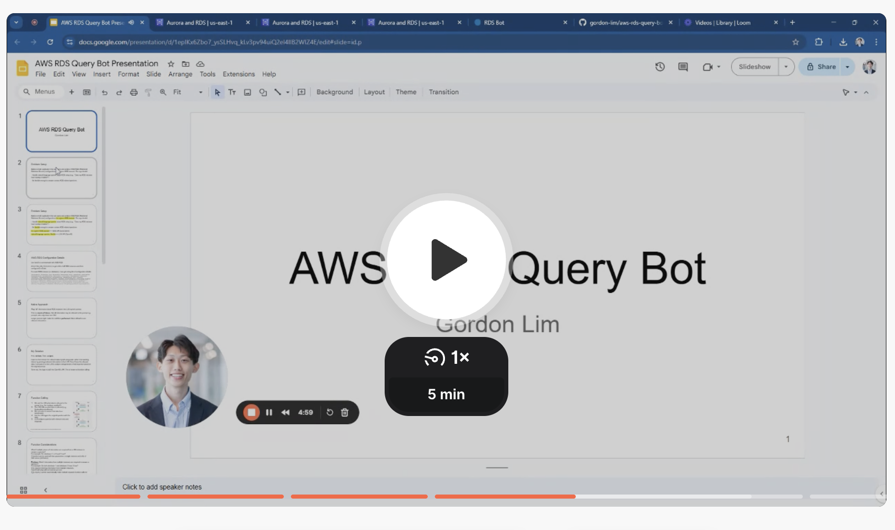
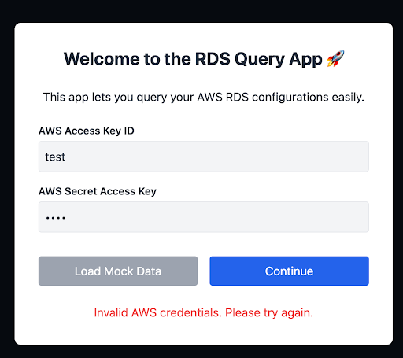
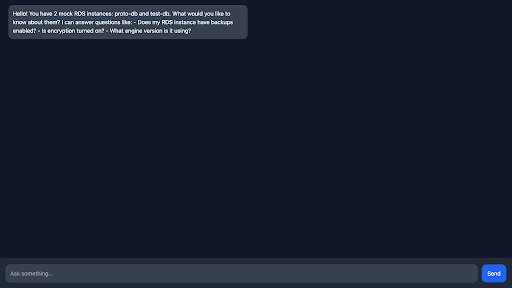

# AWS RDS Query Bot

## 🎥 Video Presentation

[](https://www.loom.com/share/867298eb5e034d5987778098cb33b511?sid=cb3adbf5-1ed7-46c7-9f6f-178979e25497)  
[Link to Slides](https://docs.google.com/presentation/d/1epIKx6Zbo7_ysSLHvq_kLv3pv94uiQ2el4lIB2WIZ4E/edit?usp=sharing)  

---

## 🚀 Try It Out

Hosted live at: [https://aws-rds-query-bot.onrender.com/](https://aws-rds-query-bot.onrender.com/)  
(Note: it may take up to a minute to load if inactive.)  
(Desktop recommended. Not tested on mobile.)

---

## About

This is a simple application that lets you query and analyze AWS RDS (Relational Database Service) configurations through natural language.  

Users can ask questions like:
- "Does my RDS instance have backups enabled?"
- "Is encryption turned on?"
- "What engine version is it using?"

The system is designed to be flexible enough to handle a wide variety of RDS-related questions.

---

## How It Works

Problem: Dumping all RDS data into the LLM prompt wastes tokens and hurts performance.

Solution:  
First, retrieve only the **relevant** fields based on the user's question using OpenAI's **function calling** feature.  
Then, pass the minimal relevant data back into the LLM for analysis and final response.

Architecture:
1. Retrieve RDS configurations from AWS (`boto3`).
2. Cache RDS data locally (refresh every 5 minutes).
3. Use OpenAI function calling to pull only relevant information.
4. Feed back retrieved information into OpenAI for final response.

---

## Function Calling Design

Function Design Iteration:
1. Single instance + list of fields: Not enough for multi-instance questions (OpenAI can only call **one function per turn**).
2. List of instances + list of fields: Risk of retrieving irrelevant information.
3. Final design: Function accepts a **list of (instance, field) pairs** for maximum flexibility.

Example Input:
```json
{
  "queries": [
    {"instance": "database-1", "field": "BackupRetentionPeriod"},
    {"instance": "database-2", "field": "StorageEncrypted"},
    {"instance": "database-2", "field": "BackupRetentionPeriod"}
  ]
}
```

---

## Instance Name Handling

Users might type approximate instance names (e.g., "database one" instead of "database-1").  
The system prompt includes the list of available RDS instance names to guide matching.

For a small number of instances, this approach is sufficient.  
For larger setups, a dynamic function could be used to retrieve instance names.

---

## Local Caching

AWS RDS configurations do not change often.  
To avoid latency:
- The RDS configuration is **cached** on setup.
- The cache is refreshed only if the last fetch was more than **5 minutes** ago.
- This balances **speed** and **data freshness**.

---

## UI Overview

### Intro Modal (AWS Credentials or Load Mock Data)

  

The user can either:
- Enter AWS credentials (Access Key ID and Secret Access Key), or
- Load mock RDS data directly. (Mock RDS data is loaded from the file `mock_rds_data.py`.)

---

### Chat Interface

  

Once connected, the chat interface allows users to ask natural language questions about their RDS setup.

---

## Installation (for local development)

```bash
git clone https://github.com/gordon-lim/aws-rds-query-bot.git
cd aws-rds-query-bot
pip install -r requirements.txt
uvicorn main:app --reload
```

You will need:
- OPENAI_API_KEY (in `.env`): An OpenAI API key (for LLM communication)
- SECRET_KEY (also in `.env`): For fastapi session
- AWS credentials (unless using mock data)

---

## Acknowledgements

This project uses OpenAI’s ChatGPT to generate code and to assist in revising and organizing documentation.  
